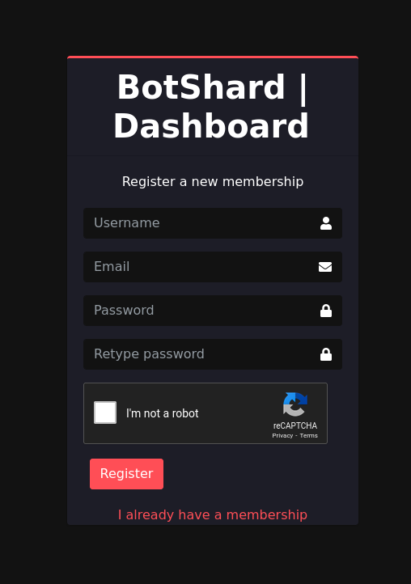
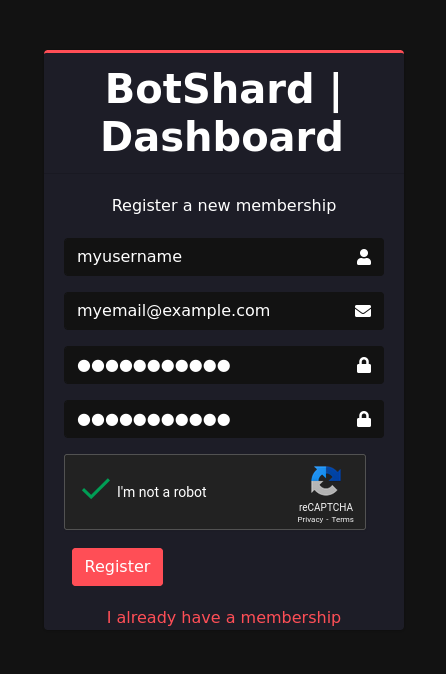
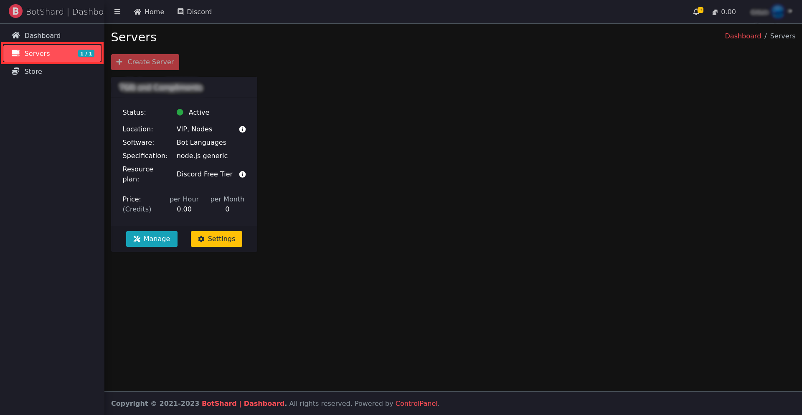
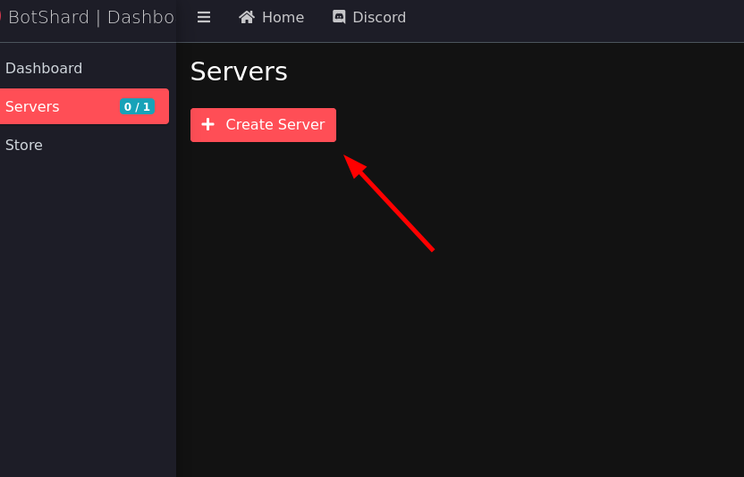

# Getting Started

### 1. Create an account

Start by creating a [Botshard](https://botshard.com/) account.
    

:::tip Tip

If you already have an account, you can skip this step.

:::

### 2. Create a server

Once you have an account, go to the [dashboard](dashboard.botshard.com), and click on the `Servers` tab.

:::tip Tip
On this page you can create servers, and see all the servers you have on Botshard.
:::

Click on the `Create Server` button.

